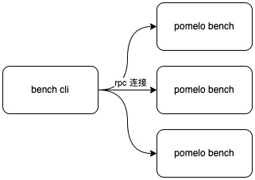

# Go Pomelo Bench 压测工具

工具分为两部分:

1. 后端压测单元（bench）
2. 前端命令行控制器(bench cli)

结构为:



压测单元实际为rpc服务端，通过grpc接口实现对压测任务的创建,操作,销毁等。

前端命令行控制器提供多压测单元控制，提供建议操作命令，通过grpc客户端连接到后端压测单元，简单实现模拟分布式压测控制。

## 快速启动

### 程序编译

```shell
# 命令详见 Makefile 
make build
```

### 本地测试快速启动

```shell
# 开启后端压测单元（bench）,cd pomelo-bench目录下, 命令详见 Makefile 
make run_bench

# 开启前端命令行控制器(bench cli)
make run_bench_cli
```

### 成功运行例子

```shell
# pomelo bench cli!

 INFO  尝试连接压测woker机器
 INFO  连接 0.0.0.0:8080 成功
 INFO  连接 0.0.0.0:8082 成功
 INFO  连接压测woker机器完成
Please select an option [type to search]: 
> connect
  send
  close
  tree
  quit
```